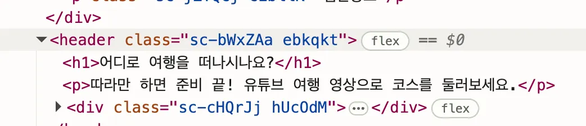

## 기본적인 브라우저 렌더링 과정

### 브라우저에 접속하면 ?

→ 서버에게 index.html 요청 → 받음

> **1. HTML 파싱**
> 브라우저는 HTML 문서를 파싱하여 DOM(Document Object Model) 트리를 생성한다. 이 과정에서 브라우저는 HTML 태그의 종류와 속성을 분석하고, 각 태그의 위치를 계산한다.

> **2. CSS 파싱**
> 브라우저는 CSS 문서를 파싱하여 CSSOM(CSS Object Model) 트리를 생성한다. 이 과정에서 브라우저는 CSS 선택자와 규칙을 분석하고, 각 규칙의 적용 범위와 우선 순위를 계산한다.

> **3. 렌더 트리 생성**
> 브라우저는 DOM 트리와 CSSOM 트리를 결합하여 렌더 트리를 생성한다. 이 과정에서 브라우저는 레이아웃과 페인팅에 필요한 정보를 추출하고, 숨겨진 요소나 비표시 요소를 필터링한다.

> **4. 레이아웃**
> 브라우저는 렌더 트리의 각 요소의 위치와 크기를 계산하여 뷰포트 내에서의 정확한 배치를 수행한다. 이 과정에서 브라우저는 브라우저 창의 크기나 스크롤 위치 등의 요소도 고려한다.

> **5. 페인팅**
> 브라우저는 렌더링된 요소들을 화면에 그린다. 이 과정에서 브라우저는 CSS 스타일, 배경, 그림자, 그림 등을 고려하며, 여러 계층으로 구성된 렌더링 요소들을 하나의 이미지로 합치는 과정도 포함된다.

### HTML 파싱과 동시에 DOM 트리 생성

```jsx
<!doctype html>
<html lang="en">
  <head>
    <link
      rel="icon"
      type="image/svg+xml"
      href="/Logo.webp"
    />
    <meta
      name="title"
      content="따라행"
    />
    <meta
      name="description"
      content="따라행은 유튜브의 여행 브이로그를 모아서, 영상에서 유튜버 분들이 실제로 방문한 여행 코스를 지도와 함께 제공 하는 서비스입니다."
    />
    <title>따라행</title>
  </head>
  <body>
    <div id="root"></div>
    <script
      src="/src/main.tsx"
    ></script>
  </body>
</html>
```

이때 script태그를 만나면, HTML 파싱을 잠시 중단합니다.

→ 이때 React, JS를 실행하게 됩니다.

```jsx
import React from 'react';
import ReactDOM from 'react-dom/client';
import App from './App';

ReactDOM.createRoot(document.getElementById('root')).render(<App />);
```

## Styled-Components

styled-components 코드가 브라우저에 어떻게 읽히는지 간단하게 살펴봅시다!

```jsx
const Title = styled.h1`
  font-size: 1.5em;
  text-align: center;
  color: palevioletred;
`;
```

---

### 1단계: styled.h1

styled-components는 `styled.h1`, `styled.div`, `styled.button`처럼 사용을 하는데요, 이때 h1, div, button은 함수 형태입니다. 이를 helper method라고 합니다.

즉, DOM 태그마다 **helper method**를 제공합니다.

```jsx
const Title = styled.h1`
  font-size: 1.5em;
  text-align: center;
  color: palevioletred;
`;
```

해당 코드를 실행하면 내부적으로 아래와 비슷한 일이 일어납니다.

```jsx
function h1(styles) {
  return function NewComponent(props) {
    const uniqueName = generateUniqueName(styles);
    const createdStyles = createStylesThroughStylis(styles);

    createWithInjectCSSClass(uniqueName, createdStyles);

    return <h1 className={uniqueName} {...props} />;
  };
}
```

즉, helper method는

- 새로운 React 컴포넌트를 만들고
- 스타일 문자열을 기반으로 고유 클래스명을 생성하고
- CSS를 준비해두었다가
- 최종적으로 `<h1>` 요소에 적용하는 구조입니다.

---

### 2단계: helper method의 실제 모습

styled-components의 `styled` 객체는 다음과 같은 형태입니다.

```jsx
styled = {
  h1: function(styles) { ... },
  div: function(styles) { ... },
  button: function(styles) { ... },
  span: function(styles) { ... },
  header: function(styles) { ... },
  ...
}
```

그중 `styled.h1`은 다음과 같은 함수를 반환합니다.

```jsx
function h1(styles) {
  return function NewComponent(props) {
    const uniqueName = generateUniqueName(styles);
    const createdStyles = createStylesThroughStylis(styles);

    createWithInjectCSSClass(uniqueName, createdStyles);

    return <h1 className={uniqueName} {...props} />;
  };
}
```

여기서 핵심은 `uniqueName`과 `createdStyles`입니다.

---

### 3단계: uniqueName & createdStyles

1. uniqueName

`styles` 문자열에 고유한 해시값을 부여합니다. 즉, `dKamQW`, `iOacVe` 같은 **고유한 클래스명**을 생성합니다.



2. createdStyles

`createStylesThroughStylis`로 스타일 문자열을 처리하여

브라우저가 읽기 좋은 **최종 CSS**로 변환합니다.

---

### 4단계: CSS 주입(createWithInjectCSSClass)

```html
<style>
  .dKamQW {
    font-size: 1.5em;
    text-align: center;
    color: palevioletred;
  }
</style>
```

컴포넌트가 렌더링되면, styled-component 고유 클래스명을 생성하고, CSS 문자열을 Stylis로 가공하고 (브라우저가 읽을 수 있는 CSS로 변환) 하고나면 다음과 같은 동작이 일어납니다.

1. `<style>` 태그를 생성하여 DOM(document.head)에 주입합니다.
2. 이후 React가 VDOM에 `<h1 class="dKamQW">Hello</h1>` 노드를 생성합니다.
3. React commit 단계에서 Virtual DOM을 진짜 DOM으로 변환합니다.

여기까지가 브라우저 렌더링 과정의 DOM생성 과정

---

### 이후 과정

**→ CSSOM 생성**

- 브라우저는 head안에 `<style>` 태그를 해석하여
- CSS를 파싱하고, CSSOM를 업데이트합니다.

**→ Render Tree 생성**

- 렌더링 엔진이 DOM + CSSOM을 결합합니다.
- 두 정보를 합쳐 **Render Tree**를 만듭니다.
- `.dKamQW` 클래스가 `<h1>`에 적용되기 때문에, 해당 스타일이 매칭됩니다.
  ```html
  <h1 class="dKamQW">Hello World</h1>
  ```

→ Layout → Paint → Composite 과정

---

### 👀 퀴즈

Wrapper의 Style은 브라우저에 주입될까요? = DOM에 `<style>` 태그가 삽입될까요?

```jsx
import styled from 'styled-components';

export default function App() {
  return <ItemList items={[]} />;
}

function ItemList({ items }) {
  if (items.length === 0) {
    return 'No items';
  }

  return <Wrapper>{/* Stuff omitted */}</Wrapper>;
}

const Wrapper = styled.ul`
  background: goldenrod;
`;
```

- **정답**
  styled-components는 이 경우에 개발자가 작성한 CSS로 아무것도 하지 않습니다!
  `items.length === 0`이라면 `<Wrapper>` 자체가 렌더링되지 않아요.
  실제로 `background` 선언은 DOM에 추가되지 않습니다.

### Tailwind CSS vs **Styled-Components**

### Tailwind CSS

Tailwind는 Utility-First CSS Framework로 미리 정의된 유틸리티 클래스를 조합하여 스타일을 구성하는 방식이다.
(\* 미리 정의된 유틸리티 클래스 = 하나의 CSS 클래스가 하나의 스타일 속성만 담당하도록 작게 분리된 클래스의 모음)

https://tailwindcss.com/

### 1. Tailwind의 특징

- HTML/JSX 내에서 className으로 스타일링
- CSS 파일 작성량을 극적으로 줄임
- 일관된 원칙을 기반으로 스타일을 조합함
- 빌드 시 불필요한 CSS를 제거 → 최적화된 번들

### 2. 유틸리티 클래스

유틸리티 클래스란?

하나의 스타일 속성만 담당하는 아주 작은 CSS클래스

```css
.rounded {
  border-radius: 0.25rem;
}

.bg-red-500 {
  background-color: rgb(239 68 68);
}

.bg-blue-500 {
  background-color: rgb(59 130 246);
}
```

Tailwind 적용 예시

→ 보통 class 속성에 여러 유틸리티 클래스를 나열합니다.

```jsx
<button
  onClick={handleSubjectResult}
  className="px-4 py-2 bg-blue-500 rounded hover:bg-blue-600 text-white rounded cursor-pointer"
>
  확인
</button>
```

Tailwind가 제공하는 유틸리티 클래스들을 다양하게 조합하면 추가적인 CSS 코드 작성 없이 단순히 HTML요소의 class속성에 설정해주는 것만으로도 스타일링이 가능하게 됩니다.

### PostCSS(post-processor)

- PostCSS는 CSS를 **빌드 타임**에 처리해 주는 도구입니다.
- CSS를 분석해서, 변환하거나 최적화하는 작업을 해 줍니다.
- Tailwind의 유틸리티 클래스들을 미리 CSS 코드로 **정적으로 생성**해 줍니다.

### 1. styled-components란?

**CSS-in-JS** 라이브러리 중 하나로 **JavaScript 파일 내에서 CSS를 작성할 수 있게 해준다.**

각 컴포넌트에 고유한 클래스를 자동으로 생성해 주기 때문에, **스타일 충돌을 방지**할 수 있다.

### 2. styled-components와 Tailwind CSS 핵심 차이점

→ 스타일 생성 시점 !

| 항목                        | **styled-components**                | **Tailwind CSS**                                                |
| --------------------------- | ------------------------------------ | --------------------------------------------------------------- |
| **접근 방식**               | JS 안에서 CSS 직접 작성              | HTML/JSX에 유틸리티 클래스 조합                                 |
| **동적 스타일링**           | `props`로 조건부 스타일 작성 쉬움    | 조건부 클래스 토글 방식                                         |
| **스타일 생성 시점과 성능** | 런타임에 CSS 생성 → 성능에 약간 영향 | 빌드 시 CSS 생성 → 브라우저 실행 중에 추가적인 스타일 계산 없음 |
| 브라우저 부담               | CSS 이미 완성 → 상대적으로 적음      | 상황에 따라 스타일 재생성 비용 발생 가능                        |

### 3. Styled-components와 Tailwind CSS 스타일 생성 시점 ‼️

- Styled-components
  - Styled-components는 **스타일 정의 자체를 개발자가 직접 작성**하며 그 스타일은 **해당 컴포넌트의 JS 코드 내부에 포함됨**
  - 스타일이 JS 코드 안에 존재하고 런타임에 해석되며 이때 해시값 기반 className 생성 `<style>` 태그에 삽입
- Tailwind-css
  - Tailwind는 **유틸리티 클래스 정의가 먼저 존재**하고 사용자가 HTML/JSX에서 **필요한 클래스만 가져다 쓰는 방식**
  - 즉, 개발자가 스타일을 작성하는 것이 아니라 **미리 만들어진 규칙(클래스 이름)을 조합하여 디자인을 구성**하는 방법.
  - Tailwind는 빌드 도중 HTML/JSX 내에서 **사용된 유틸리티 클래스만 추출하여 최종 CSS에 포함**함.

### 4. Styled-components와 Tailwind CSS 성능 차이

- Styled-components
  - 렌더마다 **JS 실행 → CSS 문자열 생성 → className hash → style insert**
  - 동적 스타일이 많을수록 **반복 비용 발생 가능**
- Tailwind

  - 빌드 시 필요 클래스 **정적 생성 + Purge**
  - 브라우저는 단순히 **기존 CSS 해석만** 하면 됨

  ### Styled-components의 성능에 대해 더 알아보자 !

  ### ❗ 성능에 좋지 않은 영향을 주는 이유 : 자주 렌더링될수록 `<style>` 태그도 자주 바뀜

  - 컴포넌트가 자주 업데이트되면, 새로 className을 만들고
  - 새로운 `<style>`이 **자주 삽입**됨 ⇒ JS와 함께 스타일 생성, 삽입 처리됨
  - 이게 많아지면 브라우저는 **스타일을 다시 계산**해야 함 → 느려짐

  ```mathematica
  → CSSOM 재계산 (recalculate styles)
     ↓
  → Render Tree 업데이트 (스타일이 바뀌면 렌더 트리도 바뀔 수 있다.)
     ↓
  → Layout (Reflow) — 요소 크기/위치 다시 계산
     ↓
  → Paint (Repaint) — 바뀐 요소 다시 그리기
     ↓
  → Composite — 화면에 합성
  ```
