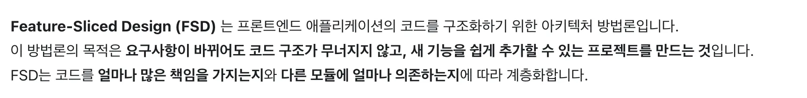
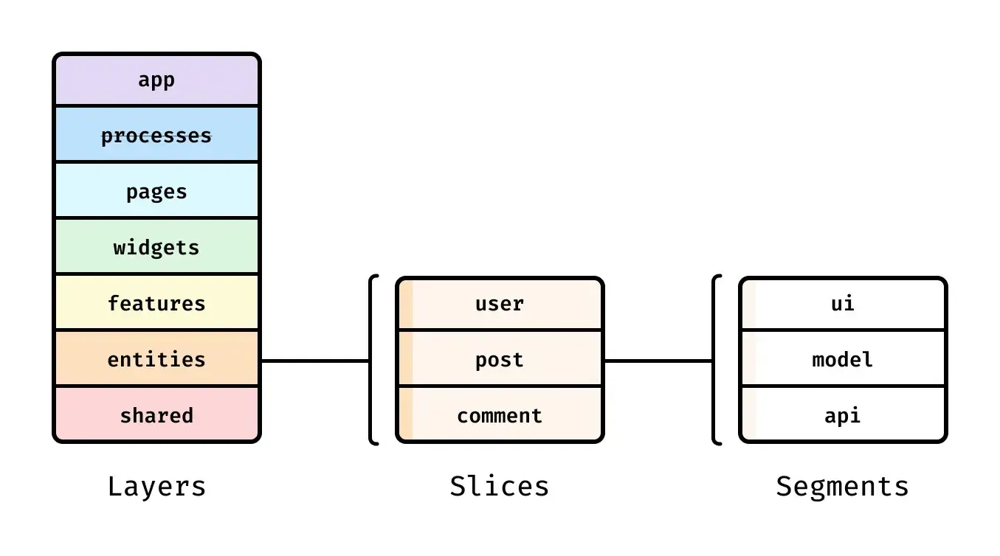

공식 문서에 나와있는 내용입니다.

목적은 다음과 같다고 합니다.

- **요구사항이 바뀌어도 코드 구조가 무너지지 않고, 새 기능을 쉽게 추가할 수 있는 프로젝트를 만드는 것**

아래 내용으로 FSD가 어떤 설계로 해당 목적을 충족시키고, 어떤 방향성을 가지고 있는지 살펴보도록 합시다!

### **FSD 아키텍처의 기본 개념**



_이미지 출처 : [FSD 공식문서](https://feature-sliced.design/docs/get-started/overview)_

FSD는 3가지 수직 블록으로 나누어볼 수 있으며, 각각 Layer, Slices, Segmaents를 나타냅니다.

그리고 각 블록간의 관계는 수평적입니다.

### 1. 레이어

먼저, 레이어는 애플리케이션을 역할, 책임의 관점에서 나눈 단위입니다.


→ 각 코드가 어떤 책임을 가지고 있는지에 따라서
6가지의 계층 **app, pages, widgets, features, entities, shared** 로 나눌 수 있습니다.

app(상위 레이어)일 수록 사용자에게 가까운 UI, 플로우 등 많은 책임 요소들을 가지고 있고, 하위 레이어로 갈 수록 작은 단위의 책임을 가지고 있습니다.

---

레이어에는 **한 가지 설계 원칙**이 있는데요.
그것은 바로, **하위 레이어는 상위 레이어를 참조할 수 없다는 것입니다.**

features는 entities를 참조할 수 있지만, 반대로 entities는 features 레이어를 참조할 수 없습니다.

### **유지보수에 용이하도록 하기 위함**

우선, 레이어의 위치가 낮을수록 더 추상화되어 있기 때문에 많은 곳에서 재사용될 수 있습니다.
특정한 매개변수나 속성에 따라 컴포넌트나 기능이 다르게 동작할 수 있습니다.
예를 들어, 변경될 가능성이 낮은 shared에서 features를 참조하고 있는 상황이라면 화면이 자주 변경 되었을 때, 변경에 의존하고 있는 코드가 많아지므로 수정이 어려워지게 됩니다.
참고로, 같은 레이어의, 같은 슬라이스 내의 코드는 서로 참조할 수 있습니다.
예를 들어, '@/features/slice/ui/case1’은 '@/features/slice/ui/case2’를 참조할 수 있습니다.

### 2. 슬라이스

슬라이스는 레이어 내에서 코드를 도메인별로 분할하는 역할을 합니다.
도메인 별로 분할한다는 점에서 **높은 응집도, 낮은 결합도**라는 특징을 가지고 있는데요.
아래에서 더 자세히 봅시다.

### 3. 세그먼트

세그먼트는 하나의 슬라이스 내부를 기술적인 역할에 따라 나눈 구조입니다.
보통은 ui, model, api, lib와 같은 형태로 구성됩니다.
세그먼트가 나온 이유를 생각해보면, 코드가 무엇을 하는가?를 기준으로 책임을 분리한 것으로 보여집니다.
하나의 도메인 내에서도 로직, API, UI 등 각각의 성격을 가진 코드들을 독립적으로 관리하게 되어, 변경 요구사항이 주어졌을 때 때 쉽게 찾아 수정할 수 있습니다.
물론, 가독성도 높아집니다.

### **FSD 아키텍처에서 가져가면 좋을 개념**

- 낮은 결합도와 높은 응집도
    <aside>
    - 결합도: 결합도는 모듈 간의 의존성을 의미합니다.
    - 응집도: 응집도는 연관된 코드들이 얼마나 잘 모여있는가를 의미합니다.
    </aside>
    
    - 높은 응집도: 도메인별로 관련된 코드가 하나의 모듈(레이어)에 모여 있는 상태
    - 낮은 결합도:  다른 도메인(모듈)의 변경이 나에게 최소한의 영향만 주는 상태
- 높은 결합도와 낮은 응집도 그림

### FSD 장점

제가 직접 적용해보고 느낀 FSD 구조의 장단점입니다.

- 우선, 폴더 위치를 찾기 조금 쉬워졌습니다. 도메인 별로 나눈 특성 때문에요.
  "무엇"을 하는 기능을 찾고 싶다 하면, 레이어 → 슬라이스 순으로 찾으면 됩니다.
- 다음은, 유지보수에 용이하다는 것입니다. 높은 응집도, 낮은 결합도로 인해서 영향 범위를 쉽게 예측할 수 있습니다.

### FSD 단점

단점은 비교적 더 잘 와닿았습니다.

- 우선, 러닝커브가 높았습니다. 처음 FSD 구조를 적용하기 위해 많은 내용을 알아야했어요.
  다른 아키텍처 솔루션들에 비해서 분리 명확하지 않고, 레퍼런스가 많지 않아 기준을 명확히 세우는 과정이 어려웠습니다.

- 두 번째는 폴더 깊이가 깊어졌습니다.
  기존 폴더 구조는 depth가 최대 2개
  하지만 FSD는 최소 3개 → 세그먼트까지 지나야 비로소 파일명이 보였습니다.

- 마지막은, **폴더 구조에 이렇게까지 고민해야할까?** 였습니다.
  폴더 구조를 수정 하면서, 여러 레이어가 섞인 컴포넌트는 분리하면서 리팩토링 해야하는데 → 시간이 많이 소요되었습니다.
  하지만, 컴포넌트를 리팩토링 하며, 해당 코드가 특정 레이어에 알맞을까?에 대해 고민하면서, 리팩토링의 방향성을 잡을 수 있었습니다.

### 적용해보며 느낀점

- 기준이 모호하다. → 적용해보며 명확한 기준을 세워야한다.

  - features, entities의 모호함.
    <aside>

    - 데이터 관련는 entities →
    - 데이터와 관련 코드이지만, 사용자의 행동과 관련 있거나, API를 맺고 끊는 관리 주체는
    - feature일까 entities일까?
    </aside>

    ex) SSE를 맺고 끊는 상태 관리 store,

    ex) useMutation, useQuery

    **해결 방법**

    → 장단점 trade-off를 생각하거나, 레퍼런스를 많이 찾아본다.

    ex) 모꼬지 레포 참고하기 (감사합니다🙇)→ **useMutation은 feature로 두었구나~!**

    ex) 장단점 생각해보기

    **결론**

    기준 세우기

    **Feature**: 사용자의 행동이나 의도를기준으로 엔티티를 조합하고 변화, 관리시키는 단위

    **Entites**: 도메인에 관련된 데이터만 다룬다.(데이터 자체로서 존재)

    | 질문                         | Entities | Feature |
    | ---------------------------- | -------- | ------- |
    | 도메인 개념인가?             | O        | X       |
    | 사용자 흐름이 없어도 설명됨? | O        | X       |
    | **여러 엔티티를 엮나?**      | X        | O       |

    **여러 엔티티를 엮어서**

    - 데이터를 만든다 → Entities
    - 행동을 만든다 → Feature

- widget이거나, page인데 → 비지니스 로직이 많다면 ?
  - 컴포넌트 분리 후 레이어 분리
- 문서화를 잘 하자.
  - 새로운 팀원이 왔을 때도 혼란을 느낄 수 있다.

이외에도

- widget이 어떤 레이어인지 명확하지 않음.
  - 기존 FSD의 의도: 재사용이 가능한 독립적인 컴포넌트(도메인에 의존 X) → ex) Header, Footer
  - feature를 단순히 조합하고, page의 방대해짐을 막는 역할로써 존재해도 괜찮지 않을까?

프로젝트의 도메인에 따라서 도메인간의 의존성이 다르기 때문에 FSD의 기준에 딱 맞는 폴더 구조를 세우는 것보다, 각 프로젝트에 가장 유리한 폴더 분리 기준을 세워보는 것도 좋을 것 같습니다.

### FSD 사용을 도와주는 라이브러리, 플러그인

[GitHub - xionhub/fsd-prettier: 🍰Feature sliced design prettier shared configuration](https://github.com/xionhub/fsd-prettier)

[GitHub - feature-sliced/steiger: Universal file structure and project architecture linter](https://github.com/feature-sliced/steiger)

적용하면 이렇게 될 것으로 예상됩니다.

```tsx
import { useEffect, useRef, useState } from 'react';
import { CSSTransition, TransitionGroup } from 'react-transition-group';
import ListSvg from '@/assets/list.svg?react';
import { Card, Flex, Heading, IconButton } from '@allcll/allcll-ui';

import SkeletonRows from '@/shared/ui/SkeletonRows.tsx';
import { getTimeDiffString } from '@/shared/lib/stringFormats.ts';
import { getSeatColor } from '@/shared/config/colors.ts';
import TableColorInfo from '@/shared/ui/TableColorInfo.tsx';
import { getDateLocale } from '@/shared/lib/time.ts';
import LiveTableTitleModal from '@/shared/ui/TableTitleSettingModal.tsx';
import { HeadTitle } from '@/shared/model/createColumnStore.ts';

import useSSESeats, {
  SseSubject,
} from '@/entities/subjectAggregate/model/useSSESeats.ts';

import useTick from '@/features/live/board/lib/useTick.ts';
import {
  SSE_STATE,
  useSSEState,
} from '@/features/live/board/model/useSseState.ts';
import { SSEType } from '@/features/live/common/api/useSSEManager.ts';

import NetworkError from '../../_errors/ui/NetworkError.tsx';
import ZeroListError from '../../_errors/ui/ZeroListError.tsx';
import PreSeatWillAvailable from '../../_errors/ui/PreSeatWillAvailable.tsx';
import SystemChecking from '../../_errors/ui/SystemChecking';
import { useLiveTableStore } from '../model/useLiveTableColumnStore.ts';
```
