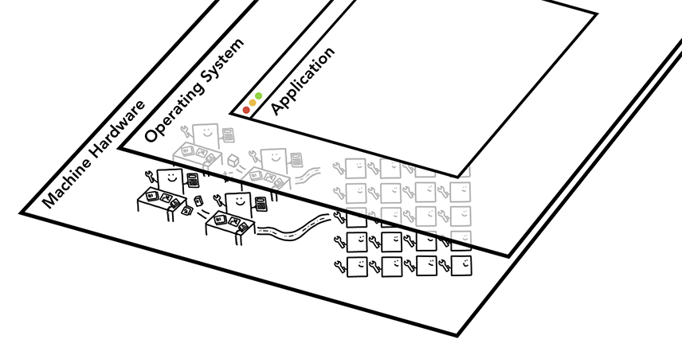

# 브라우저 내부 살펴보기

## GPU와 CPU

애플리케이션의 동작 = gpu + cpu

브라우저 하드웨어 가속 - 주로 gpu를 사용한 그래픽 작업의 가속 의미

1. 특정 CSS 속성 사용 (transform, opacity, will-change 등)
2. 비디오 재생 및 캔버스 요소 처리
3. WebGL 및 3D 그래픽 렌더링
4. CSS 애니메이션 및 트랜지션
5. 복잡한 레이어 합성(Compositing) 작업

애플리케이션 시작 - 메모리 공간 할당

애플리케이션 닫음 - 운영체제가 메모리를 비움

브라우저 상에서 프로레스 정보를 공유하는 방식 - ipc(inter process communication)

## 브라우저 아키텍쳐

방법1 - 스레드를 여러개 사용하는 프로세스를 통해 통신

방법2 - 스레드를 조금 사용하는 프로세스 여러개를 통해 ipc 통신

→ 정해진 방식은 없음 브라우저마다 접근 방식이 매우 상이

크롬 아키텍쳐 

- 탭마다 프로세스 할당 (process per tab)

- 사이트마다 프로세스 할당 (process per site)

 (iframe에 있는 사이트 포함)

## 각 프로세스의 역할

| 프로세스 | 프로세스가 제어하는 부분 |
| --- | --- |
| 브라우저 프로세스 | 주소 표시줄, 북마크 막대, 뒤로 가기 버튼, 앞으로 가기 버튼 등 애플리케이션의 "chrome" 부분을 제어한다.네트워크 요청이나 파일 접근과 같이 눈에 보이지는 않지만 권한이 필요한 부분도 처리한다. |
| 렌더러 프로세스 | 탭 안에서 웹 사이트가 표시되는 부분의 모든 것을 제어한다. |
| 플러그인 프로세스 | 웹 사이트에서 사용하는 플러그인(예: Flash)을 제어한다. |
| GPU 프로세스 | GPU 작업을 다른 프로세스와 격리해서 처리한다. GPU는 여러 애플리케이션의 요청을 처리하고 같은 화면에 요청받은 내용을 그리기 때문에 GPU 프로세스는 별도 프로세스로 분리되어 있다. |

gpu 프로세스는 어디서 쓰이는거지?

HTML → DOM Tree → CSSOM Tree → Render Tree → Layout → Paint → **Composite**

**하드웨어(GPU) 가속은 주로 마지막에 있는 Composite 단계에서 일어난다.**

## 다중 프로세스 아키텍쳐

프로세스 분리 이유

### 프로세스 오류 시 방지

랜더러 프로세스가 하나 마비되면 전체 탭이 마비

→ 랜더러 프로세스를 각 탭마다 분리

→ 랜더러 프로세스가 문제 되더라도 브라우저 프로세스가 동작하기 때문에 브라우저 종료가 아닌 오류 페이지로 문제 해결

### 보안과 격리

브라우저는 특정 프로세스가 특정 기능을 사용할 수 없게 제한

SOP 정책을 지키기 위해 사이트를 격리하는 효과적 방법 - 프로세스 분리하기

같은 랜더러 프로세스 사용 = 서로 다른 사이트간의 메모리 공유

→ 위의 사진 - 랜더러 프로세스가 분리된 모습

### 샌드박스된 렌더러 프로세스

- **예:**
    
    크롬의 “렌더러 프로세스”는 웹페이지의 HTML/CSS/JS를 렌더링하지만,
    
    이 프로세스는 OS의 `sandbox` 권한 하에서 돌아갑니다.
    
    - 예를 들어 macOS에서는 `seccomp` 규칙으로 시스템 호출(syscall)을 차단합니다.
    - Windows에서는 “Job Object”와 “Integrity Level”을 이용해 프로세스 권한을 제한합니다.
- 결과적으로, 이 프로세스는 GPU나 네트워크에 직접 접근하지 못하고, 반드시 “GPU 프로세스”나 “Network 프로세스”를 통해 요청해야 합니다.

프로세스 - 공통 부분을 공유 (JS 엔진 V8)

동일한 프로세스의 스레드 - 메모리 공유 가능

→ 크롬은 메모리 절약을 위해 

일정 수 이상의 탭일 경우 한 프로세스 내에서 여러 탭을 처리

## 크롬의 메모리 절약

핵심 아이디어

리소스가 제한적일 경우 - 하나의 프로세스
성능이 좋은 하드웨어 - 프로세스 분할

## 랜더러 프로세스

주요역할 - HTML과 CSS, JS를 사용자와 상호작용을 할 수 있는 웹페이지로 변환하는 것

### DOM 구축

1. 페이지를 이동하는 내비게이션 실행 메세지를 브라우저 프로세스가 주면 랜더러 프로세스가 받고 HTML 데이터 수신
2. 랜더러 프로세스의 메인 스레드는 문자열 파싱 dom 구축

### 하위 리소스 로딩

- 과정
    1. 이미지, CSS, JS 같은 외부 리소스를 위한 로딩 필요
    2. 메인 스레드가 요청하는 대신 프리로드 스캐너 실행
    3. 프리로드 스캐너는 IMG나 LINK같은 태그 있을 시 브라우저 프로세스의 네트워크 스레드에 요청
    4. script태그를 만날 경우 html 파서는 html 문서의 파싱을 일시 중지하고 js 코드 로딩하고 파싱해 실행 → document.write같은 메서드가 문서 모양 변형 가능
    
    → 이때 리소스 로깅에 대한 힌트를 브라우저에게 줄 수 있다.
    
    script태그에 async 속성이나 defer 속성을 추가 (js코드를 비동기 실행 html 실행 막지 않음)
    
- 프리로드 스캐너?
    
    모든 브라우저에는 원시 마크업을 [토큰화](https://en.wikipedia.org/wiki/Lexical_analysis#Tokenization)하고 [객체 모델](https://developer.mozilla.org/docs/Web/API/Document_Object_Model)로 처리하는 기본 HTML 파서
    
     **`async`** 또는 **`defer`** 속성이 없는 **`<script>`** 요소로 로드된 스크립트와 같은 [차단 리소스](https://developer.chrome.com/docs/lighthouse/performance/render-blocking-resources?hl=ko)를 찾을 때까지 파서가 일시중지될 때까지 계속 진행
    

### 스타일 계산

메인 스레드는 css를 파싱하고 dom노드에 해당된 계산된 스타일을 확정

### 레이아웃

- 과정
    
    문서의 구조와 각 노드의 스타일을 알지만 페이지를 렌더링하기에는 충분 x
    
    레이아웃은 요소의 기하학적 속성을 찾는 과정
    
    레이아웃 트리는 x, y 좌표, 박스 영역(bounding box)의 크기와 같은 정보를 가지고 있다. 
    
    dom트리와 비슷한 구조이지만 웹 페이지에 보이는 요소 관련 정보만 가짐
    
    ex) display: none 속성 요소는 레이아웃 트리 포함 x
    

## 페인트

요소의 크기, 모양, 위치를 알아도 어떤 순서로 그릴지 판단

렌더링 파이프라인에서 파악해야 할 가장 중요한 점

**각 단계에서 이전 작업의 결과가 새 데이터를 만드는 데 사용된다는 것이다.** 

ex) 레이아웃 트리에서 변경이 생겨 문서의 일부가 영향을 받으면 페인팅 순서도 새로 생성해야 한다. → 리플로우가 리페인트보다 비용이 많이 드는 이유

## 합성

**래스터화** - 요소의 각 스타일, 요소의 기하학적 속성, 페인트 순서를 바탕으로 픽셀로 변환하는 과정

→ 페인트와 그리기는 용어가 다른데 그리기는 페인트 작업을 바탕으로 비트맵이나 텍스처를 만들어내는 것 즉 **합성 프레임을 만들어내는 것을 말한다.**

**합성** - 웹페이지의 각 부분을 레이어로 분리해 별도로 래스터화 하고 컴포지터 스레드라고 하는 별도의 스레드에서 웹 페이지로 합성하는 기술

### 여러 레이어 나누기

메인 스레드는 레이아웃 트리를 순회하며 레이어 트리를 만들어 낸다.

레이어 합성 작업이 페이지 작은 부분을 매 프레임마다 래스터화하는 작업보다 오래 걸릴 수 있으므로 랜더링 성능은 측정을 해야됨

→ 크롬은 레이어가 너무 많아지는 것 방지를 위해 레이어를 합치기도 함

### 메인 스레드 이후 랜스터화와 합성

컴포지터 스레드 - 래스터링 스케줄링 관리 역할

1. 각 레이어를 래스터화한다.
2. 어떤 레이어는 페이지의 전체 길이 만큼 클 수 있어서 레이어를 타일 형태로 분산하여
    
    래스터 스레드로 보낸다.
    
3. 래스터 스레드간의 우선순위를 지정할 수 있다. 

래스터 스레드 - 래스터링 역할

1. 각 타일을 래스터화해 gpu 메모리에 저장한다.

빈곳 = 래스터화하지 못한 영역

→ (래스터 스레드들)다중 스레드를 통해 이 타일을 채우는 것이 목표

드로쿼드 - 메모리에서 타일의 위치와 웹 페이지 합성을 고려해 

타일을 웹 페이지의 어디에 그려야하는지 정보

합성 프레임 - 웹 페이지의 프레임을 나타내는 드로 쿼드의 모음

1. 합성 프레임이 ipc를 통해 브라우저 프로세스로 전송
2. 다른 렌더러 프로세스에 의해 합성 프레임 추가
3. 합성 프레임은 gpu에 전송되어 화면에 표시

합성의 이점 - 메인스레드와 별개로 작동하기 때문에

js 실행이나 스타일 계산을 기다리지 않아도 된다.

→ 레이아웃이나 페인트를 다시 계산해야 할 경우에만 메인스레드 관여