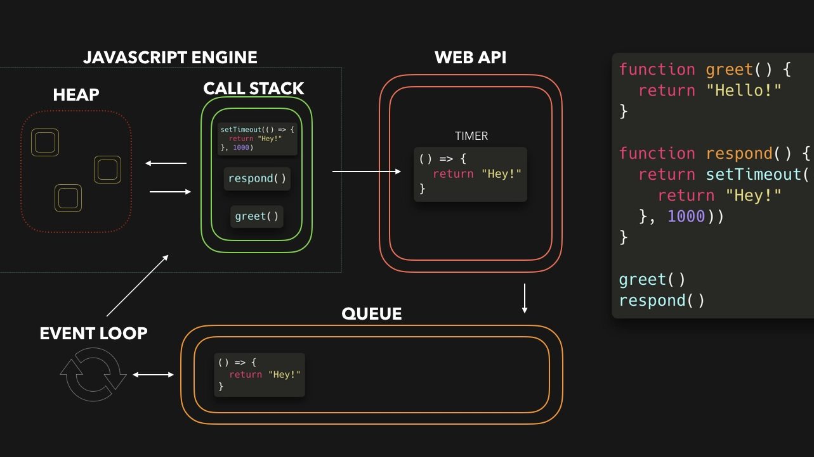
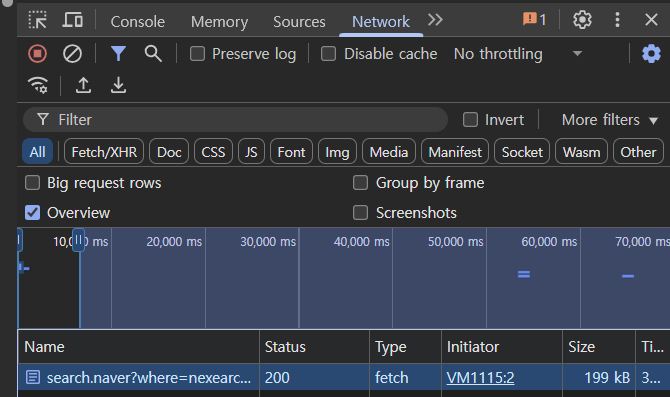

# Javascript 비동기 처리

# 목차

자바스크립트의 비동기를 깊게 알아가보자

1. 선정 이유
2. 자바스크립트 (런타임) 구조
    1. Task Queue
    2. Microtask Queue
3. Event Loop 동작 과정
4. 퀴즈1
5. 퀴즈2
6. 퀴즈3
7. 번외
8. 출처

# 선정이유

### 자바스크립트의 비동기 처리에 대해서 알려주세요

microtask queue 가 먼저 실행이 되고, macrotask queue 가 나중에 처리됩니다.

microtask queue 에는 promise의 callback 함수가 들어가고, …

macrotask queue 는 하나가 아닙니다

`setTimeout(()⇒{}, 0);` 이건 언제 실행되죠?

macrotask queue 가 자바스크립트 엔진에 없다고요?

<aside>
🔑

이 질문을 이번에 해결해보자!!

</aside>

# 자바스크립트 (런타임) 구조



- **호스트, (자바스크립트) 런타임**: 자바스크립트의 환경을 구성, 실행. → 브라우저, Node.js
    - **JS Engine**: 자바스크립트 언어 해석기 (js → bytecode). V8, Webkit…
        - Heap
        - Call stack
    - **EventLoop**: Task를 조정하기 위해 사용(스케줄링), agent 마다 1개
        - **TaskQueue:** 실행 가능한 Task를 저장하는 Set. 1개 이상임. (각각의 프로세스를 더 빠르게 사용하기 위해서.)
            - **Task:** 이벤트, Web API 등등
        - **MicrotaskQueue:** JobQueue 라고도 부름 (ECMA Script) - 논리적
            - Microtask: 빠르게 처리해야 할 task : Promise, MutationObserver …
            - task 가 끝날 때 마다, Microtask Queue 모두 실행.
    - Web API : 브라우저에서 실행 할 수 있는 API, 실행은 브라우저 엔진에 위임.
        - 병렬 처리 가능하다.
        - Task 로 분류 됨.
    
    ## TaskQueue (Macrotask Queue)
    
    - task 를 저장하기 위한 큐
    - EventLoop 마다 1개 이상의 큐
    - Set (FIFO 아님) : 실행 가능한 Task 를 반환해야하기 때문에
    
    ### Task
    
    이벤트, 파싱, 콜백호출, 리소스사용, Dom 조작 반응하기 위한 Task 
    
    ## Microtask Queue (Job Queue)
    
    - Promise, MutationObserver 등 을 위한 큐
    - 콜스택이 비워지거나, 하나의 Task 가 종료되면 모두 실행
    - `queueMicrotask` 메서드로  콜백 등록 가능
    - V8 엔진 내부에 구현, 관련 메서드 제공.
        - `performMicrotaskCheckpoint` : microtask queue 를 비우고, 모두 실행
    - but, 이벤트루프에 의해서 스케줄링 됨
    
    # Event Loop 동작 과정
    
    1. 콜스택에 스크립트가 올라가서 동기 코드 실행
    2. 동기 코드가 비동기 API 호출하면 Web API가 처리하고 콜백을 적절한 큐에 넣음
    3. 콜스택이 비워지면 **마이크로태스크 큐**를 모두 비움(모든 마이크로태스크 실행)
    4. 마이크로태스크가 끝나면 렌더링(브라우저가 필요한 경우)
    5. 렌더링 이후 매크로태스크 큐에서 다음 작업을 하나 꺼내 실행
    6. 반복
    
    # 퀴즈1: 실행순서
    
    ```jsx
    Promise.resolve().then(() => console.log("1"));
    console.log("2");
    
    setTimeout(() => {
    	Promise.resolve().then(() => console.log("3"));
    	console.log("4");
    }, 0);
    
    console.log("5");
    
    Promise.resolve().then(() => {
    	setTimeout(() => console.log("6"), 0);
    	console.log("7");
    }, 0);
    
    console.log("8");
    ```
    
    - 제 생각
        
        2 → 5→ 8 → 1 → 7 → 4 → 3 → 6
        
        우선 콜스택을 전부 비우고
        
        다음 매크로 태스크 [ (4)  마이크로 태스크 (3)  ] 
        
        Promise 큐에 쌓은거 우선순위   [1 → 7 (마이크로) ]
        
        그러다가 setTimeOut만나서 매크로 태스크에 저장, (6)
        
    
    ### 보기
    
    ```bash
    1
    2
    3
    4
    5
    6
    7
    8
    ```
    
    ```bash
    2
    5
    8
    1
    4
    7
    3
    6
    ```
    
    ```bash
    2
    5
    8
    1
    7
    4
    3
    6
    ```
    
    ## 퀴즈1 풀이
    
    1. Microtask Queue ← console.log(1);
    2. 출력 `2`
    3. Task Queue ← setTimeout Callback
    4. 출력 `5`
    5. Microtask Queue ← promise resolve callback
    6. 출력 `8`
    7. MicrotaskQueue 작업을 모두 처리
        1. 출력 `1`  > 1번에 들어간 microtask
        2. promise resolve callback 실행 (5번)
            1. Task Queue ← setTimeout Callback
            2. 출력 `7` 
    8. Task Queue - setTimeout 작업 완료 (3)
        1. Microtask Queue ← promise resolve callback
        2. 출력 `4`
    9. Microtask Queue 작업 모두 처리
        1. promise resolve callback 실행 (8-a)
            1. `3`
    10. Task Queue - setTimeout 작업 완료 (7-b-i)
        1. 출력 `6`
    

# 퀴즈 2: Render 블로킹

```jsx
const SIZE = 5000000000
for (let i = 0; i < SIZE; i++)
	if (i % 10000 === 0)
		document.body.innerText = i+'';
document.body.innerText = '';
```

## 해결 방법

콜스택이 비어있지 않기(자바스크립트가 실행되고 있기) 때문에, 렌더링이 블로킹 됩니다.

```jsx
const SIZE = 5000000000

let i = 0;
function count() {
	for (; i < SIZE; i++) {
		if (i % 100000000 === 0) {
			document.body.innerText = i+'';
			
			if (i < SIZE) {
				setTimeout(count, 0);
				i++;
				break;
			}
		}
	}
	
	if (i >= SIZE)
		document.body.innerText = '';
}

count();
```

# 퀴즈 3: 이벤트

```jsx
$inner.addEventListener('click', () => {
	Promise.resolve().then(() => console.log("Promise 1"));
	console.log('click 1');
});

$inner.addEventListener('click', () => {
	Promise.resolve().then(() => console.log("Promise 2"));
	console.log('click 2');
});

$outer.addEventListener('click', () => {
	Promise.resolve().then(() => console.log("Promise 3"));
	console.log('click 3');
});
```

```jsx
$inner.dispatchEvent(new Event('click', { bubbles: true; }))
```

# 번외: Web API 의 병렬 처리

```jsx
// 네트워크 요청은 병렬처리가 가능할까? => Yes
fetch("https://search.naver.com/search.naver?where=nexearch&sm=top_hty&fbm=0&ie=utf8&query=naver&ackey=3w8uikf6")
	.then((data) => data.text())
	.then(res => console.log(res));

const SIZE = 5000000000
for (let i = 0; i < SIZE; i++)
	if (i % 100000000 === 0)
		console.log(i);
```

- 결과
    
    
    

# 출처

https://html.spec.whatwg.org/multipage/webappapis.html#event-loop

https://tc39.es/ecma262/#sec-agents

https://ko.javascript.info/event-loop

https://inpa.tistory.com/entry/%F0%9F%94%84-%EC%9E%90%EB%B0%94%EC%8A%A4%ED%81%AC%EB%A6%BD%ED%8A%B8-%EC%9D%B4%EB%B2%A4%ED%8A%B8-%EB%A3%A8%ED%94%84-%EA%B5%AC%EC%A1%B0-%EB%8F%99%EC%9E%91-%EC%9B%90%EB%A6%AC

https://youtu.be/YpQTeIqjC4o

with. chat GPT