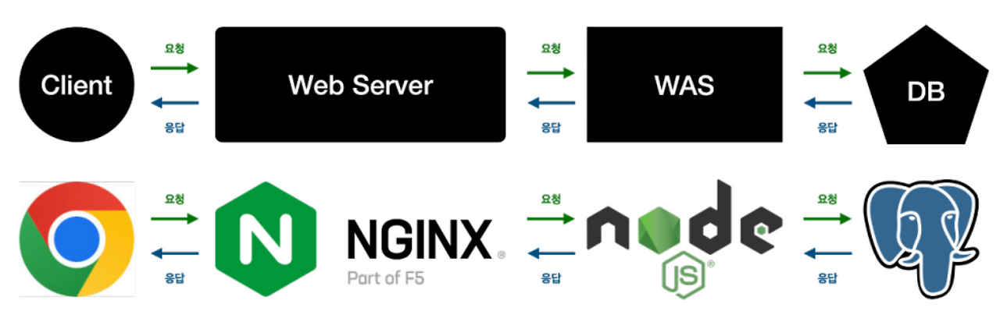
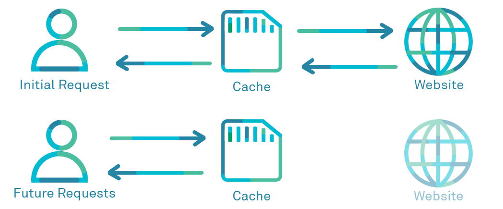

# 당신이 놓친 90%: 프론트엔드 성능 최적화, 웹 캐싱

총 투표 수: 0
생성자: 현우 채
주차: 3주차
일정: 세션 발표 (https://www.notion.so/293f13fa572b80e0bc12ca20cf36f23a?pvs=21)

## 캐싱 전략

- 속도가 느릴 때 사용할 수 있는, 좋은 방안 중 하나
- 프론트엔드는 어떤 걸 캐싱하면 좋을까?
- 정말 문제가 없을까?

---

## Section 0. 서버 인프라 설계

프론트가 인프라도 해야해요?

- **캐싱**은 응답을 **주는 곳 / 받는 곳** 둘        다 존재할 수 있습니다.

## Section 1. 캐싱 위치 시각화: 요청은 어디서 멈추는가?

사용자의 요청이 서버에 도달하기까지, 캐싱이 발생하는 4가지 주요 계층이 있습니다. 이 계층을 이해하는 것이 캐시 전략 설계의 출발점입니다.

| **계층** | **위치** | **개발자 제어 방식** | **특징 및 역할** |
| --- | --- | --- | --- |
| **1. 인메모리** | 프레임워크/라이브러리 | **완벽 제어 (JS API)** | 가장 빠르고, 서버 상태 관리 라이브러리(TanStack Query)의 핵심. |
| **2. 브라우저** | 디스크 / `Cache Storage` | **완벽/간접 제어** | HTTP 헤더 규칙 준수 및 Service Worker를 통한 고급 제어. |
| **3. CDN/프록시** | 중간 서버 | **간접 제어 (HTTP 헤더)** | 정적 리소스를 사용자에게 가장 가깝게 배포. 인프라 협업 필수. |
| **4. Origin 서버** | 백엔드 서버 | 백엔드 제어 | 최종 데이터를 제공하며, 캐시 규칙을 설정(HTTP 헤더). |

우리는 이 중에서 **인메모리**와 **브라우저** 계층을 코드로 직접 제어하며, **CDN/프록시** 계층을 HTTP 헤더로 유도하는 전략을 집중적으로 다룰 것입니다.

---

## Section 2. 계층별 캐싱 전략: 웹/인프라 & 서비스 제어

데이터를 어디에 캐싱할까요? ***서버 캐싱 VS 클라이언트 캐싱***

### 1. 웹 & 인프라 캐시 (정적 리소스와 HTTP 헤더)

### Cache-Control Header

### I. 신선도 (Freshness) 및 수명 관리 지시어

리소스가 캐시 내에서 얼마나 오랫동안 유효한지, 혹은 얼마나 오래된 리소스를 허용할지 정의합니다.

| **지시어** | **주요 사용처** | **설명 및 용도** |
| --- | --- | --- |
| **`max-age=<seconds>`** | 응답, 요청 | 리소스가 신선하다고 간주되는 **최대 수명(TTL)**을 초 단위로 지정합니다. 요청 시 사용하면 지정된 시간보다 오래된 캐시는 거부합니다. |
| **`s-maxage=<seconds>`** | 응답 | **공유 캐시(CDN, 프록시)**에만 적용되는 `max-age`를 재정의합니다. 사설 캐시는 무시합니다. |
| **`max-stale[=<seconds>]`** | 요청 | 클라이언트가 캐시 만료 시간을 **초과한 응답**을 받아들일 수 있음을 나타냅니다. (시간 지정 가능) |
| **`min-fresh=<seconds>`** | 요청 | 클라이언트가 적어도 지정된 시간 이상 남은 수명을 가진 응답을 원함을 나타냅니다. |
| **`immutable`** | 응답 | 리소스가 절대 변경되지 않음을 나타냅니다. 캐시 수명이 남아있는 한 **재검증 요청 없이** 즉시 사용됩니다. |
| **`stale-while-revalidate=<seconds>`** | 응답 | 캐시 만료 후 지정된 시간 동안 **오래된 응답**을 제공하면서, **백그라운드에서 비동기적 재검증**을 수행하도록 지시합니다. |
| **`stale-if-error=<seconds>`** | 응답 | 네트워크 오류 발생 시, 지정된 시간 동안 **오래된 캐시**를 응답으로 사용할 수 있음을 허용합니다. |

---

### II. 재검증 (Revalidation) 및 저장 금지 지시어

캐시 사용 전 유효성 검사 절차를 강제하거나, 캐시 자체를 금지합니다.

| **지시어** | **주요 사용처** | **설명 및 용도** |
| --- | --- | --- |
| **`no-cache`** | 응답, 요청 | 캐시는 저장하지만, 사용자에게 제공하기 전에 **반드시 원 서버로 재검증**을 요청해 유효성을 확인해야 합니다. 요청 시 사용하면 최신 버전 확인을 강제합니다. |
| **`no-store`** | 응답, 요청 | 캐시가 클라이언트 요청이나 서버 응답에 관해 **어떤 것도 영구적으로 저장해서는 안 됨**을 명시합니다. **민감 정보 보호**에 필수입니다. |
| **`must-revalidate`** | 응답 | `max-age` 만료 후 **반드시 재검증**해야 하며, 네트워크 단절 시 만료된 캐시 사용을 금지합니다. |
| **`proxy-revalidate`** | 응답 | `must-revalidate`와 동일하나, **공유 캐시(프록시)**에만 적용됩니다. |

---

### III. 접근성 (Accessibility) 및 기타 제어 지시어

캐시된 리소스에 대한 접근 권한을 지정하거나, 변형 금지 등 기타 제어를 수행합니다.

| **지시어** | **주요 사용처** | **설명 및 용도** |
| --- | --- | --- |
| **`public`** | 응답 | 응답이 **모든 캐시(공유 및 사설)**에 의해 저장되어도 좋다는 것을 나타냅니다. |
| **`private`** | 응답 | 응답이 **단일 사용자만을 위한 것**이며, **공유 캐시**에 저장되어서는 안 됩니다. (브라우저 등 사설 캐시만 저장 가능) |
| **`no-transform`** | 요청, 응답 | 중간 프록시나 캐시가 리소스의 컨텐츠 타입(예: 이미지 포맷)을 변경하는 등의 **변형을 가하지 않도록** 요청합니다. |
| **`only-if-cached`** | 요청 | 캐시된 응답이 있다면 그것만 사용하고, **없다면 네트워크 요청을 시도하지 않습니다.** (오프라인/제한된 환경 시 유용) |

### IF-Modi…. (재검증 헤더)

### 1. 검증자 (Validators) 헤더

서버가 리소스의 버전을 정의하는 데 사용하며, 클라이언트가 조건부 요청에 사용합니다.

| **헤더** | **유형** | **역할 및 디테일** |
| --- | --- | --- |
| **`ETag`** (Entity Tag) | 응답 | 서버가 리소스의 내용에 기반하여 생성하는 **고유한 토큰(문자열)**입니다. 리소스 내용이 단 1바이트라도 변경되면 이 값은 달라집니다. 가장 정밀한 버전 관리 수단입니다. |
| **`Last-Modified`** | 응답 | 리소스가 서버에서 **마지막으로 수정된 일시**를 나타냅니다. ETag보다 구현이 간단하지만, 1초 미만의 변경은 감지하지 못할 수 있습니다. |

---

### 2. 조건부 요청 (Conditional Requests) 헤더

클라이언트가 서버에 캐시된 리소스를 보낼 때 사용하는 헤더로, 서버는 이 값을 검증자(`ETag`, `Last-Modified`)와 비교합니다.

| **헤더** | **유형** | **작동 방식** | **서버 응답 조건** |
| --- | --- | --- | --- |
| **`If-None-Match`** | 요청 | 클라이언트가 현재 가지고 있는 `ETag` 값을 서버에 보냅니다. 주로 **GET 또는 HEAD 요청** 시 재검증을 위해 사용됩니다. | 클라이언트의 `ETag`가 서버의 현재 `ETag`와 **일치하면** → **`304 Not Modified`** (바디 전송 없음) |
| **`If-Modified-Since`** | 요청 | 클라이언트가 리소스를 **마지막으로 수신한 시간**을 서버에 보냅니다. 주로 재검증을 위해 사용됩니다. | 클라이언트의 시간 이후로 리소스가 **수정되지 않았다면** → **`304 Not Modified`** (바디 전송 없음) |
| **`If-Match`** | 요청 | 클라이언트가 현재 가지고 있는 `ETag` 값을 서버에 보냅니다. 주로 **PUT, POST, DELETE 요청** 시 사용되며, 리소스 변경 전 **데이터 충돌 방지**가 목적입니다. | 클라이언트의 `ETag`가 서버의 현재 `ETag`와 **일치하는 경우에만** → 요청 허용 (예: `200 OK`) |
| **`If-Unmodified-Since`** | 요청 | 클라이언트가 리소스를 **마지막으로 수신한 시간**을 서버에 보냅니다. `If-Match`와 마찬가지로 **데이터 충돌 방지**가 목적입니다. | 클라이언트의 시간 이후로 리소스가 **수정되지 않았다면** →요청 허용 |

### 3. 기타 캐싱 관련 헤더

| **헤더** | **유형** | **역할 및 디테일** |
| --- | --- | --- |
| **`Expires`** | 응답 | 캐시가 만료되는 **절대 시각**을 지정합니다. `Cache-Control: max-age`가 있으면 **무시됩니다.** (레거시 헤더) |
| **`Pragma: no-cache`** | 요청, 응답 | HTTP/1.0 하위 호환성을 위한 헤더로, HTTP/1.1 이상의 버전에서는 `Cache-Control: no-cache`가 사용됩니다. (주로 레거시 환경에서만 사용) |
| **`Vary`** | 응답 | 캐시가 리소스를 저장할 때, **헤더 값이 다르면** 다른 캐시로 간주하도록 지정합니다. (예: `Vary: Accept-Encoding`은 압축 여부에 따라 캐시를 다르게 저장) |

### Cache Busting

네이밍 기반, 캐시 ***강제 무효화*** 기법

- `style.v2.css`
- `/v2/style.css`
- `style.css?v=2`

### 2. 웹 서비스 캐시 (클라이언트 데이터 제어)

### A. In-Memory Cache (서버 상태 관리)

- **구분:** UI 상태와 비동기 데이터를 명확히 분리하고, 서버 상태 관리 라이브러리(TanStack Query, SWR)를 활용합니다.
- **SWR (Stale-While-Revalidate):**
    - **원리:** 이전 데이터를 즉시 표시(**Stale**)하고, 백그라운드에서 최신 데이터를 가져와 업데이트(**Revalidate**)합니다.
    - **이점:** 사용자에게 **로딩 화면 노출 시간을 최소화**하여 체감 속도를 극대화합니다.
- **자동 리페칭:** 브라우저 탭 포커스 이동, 네트워크 재연결 시 자동으로 데이터를 업데이트하여 **데이터 정합성**을 유지합니다.

### B. Service Worker Cache (고급/오프라인 제어)

- **역할:** Service Worker 스크립트가 모든 네트워크 요청을 가로채고, `Cache Storage API`를 통해 응답을 직접 캐시합니다.
- **고급 패턴:**
    - **Cache Falling Back to Network (CFBN):** 캐시에 있으면 무조건 캐시 사용 (오프라인 우선).
    - **Network Falling Back to Cache (NFBC):** 네트워크를 우선 시도하고 실패 시 캐시된 데이터를 사용 (최신 정보 우선).

---

## Section 3. 캐싱의 어두운 면: 고려해야 할 4가지 문제와 극복 전략

캐싱은 축복이지만, 잘못 설계하면 재앙입니다. 이 네 가지 난제를 반드시 인지해야 합니다.

### 1. 캐시 무효화 (Invalidation) 문제

- **도전:** "컴퓨터 과학에서 가장 어려운 문제"로 불립니다. 언제, 무엇을, 어떻게 무효화할지 결정하기 어렵습니다.
- **극복 전략:**
    - **정적 파일:** `Cache Busting`을 통한 강제 무효화.
    - **API 데이터:** `TTL` (수명)을 짧게 잡거나, 데이터 변경 API 호출 후 관련 캐시를 즉시 **수동으로 무효화**(`invalidateQueries`).
    - 데이터의 **실시간성 여부**에 따라 다르게 설정.

### 2. 데이터 정합성 (Consistency) 문제

- **도전:** 캐시된 데이터와 서버 원본 데이터 간의 불일치(Staleness)가 발생합니다.
- **극복 전략:** 서버 상태 관리 라이브러리의 **자동 리페칭** 기능을 적극적으로 활용하여, 사용자가 활동하는 동안 백그라운드에서 데이터 신선도를 유지합니다.

### 3. 낙관적 업데이트의 위험 (Optimistic UI)

- **도전:** 서버 응답을 기다리지 않고 UI를 먼저 업데이트하여 UX는 좋지만, 요청 실패 시 **데이터 롤백**이 필수적입니다.
- **극복 전략:** 서버 실패 시 **반드시 원본 상태로 롤백**하고, 사용자에게 명확하게 오류를 알리는 코드를 철저히 설계해야 합니다.

### 4. 보안 및 민감 정보 캐싱 문제

- **도전:** 개인 식별 정보(PII)나 인증 토큰 같은 민감한 정보가 캐시되는 것을 막아야 합니다.
- **주의 사항:** 해당 API 응답에는 **`Cache-Control: no-store`** 헤더를 설정하여, 브라우저나 그 어떤 중간 서버에도 **절대 저장되지 않도록** 강력하게 지시해야 합니다.

---

## 결론: 캐싱, 선택이 아닌 설계입니다.

오늘 우리는 4가지 캐시 계층을 넘나들며 성능과 비용을 절약하는 방법을 알아보았습니다. 캐싱은 이제 더 이상 인프라의 일이 아닙니다.

여러분의 서비스에 최적화된 하이브리드 캐싱 전략을 구축하여, 사용자에게 **가장 빠르고 안정적인 경험**을 제공하는 프론트엔드 아키텍트가 되시기를 바랍니다.

감사합니다.

---

### 참고자료

https://goddaehee.tistory.com/171

https://toss.tech/article/smart-web-service-cache

https://developer.mozilla.org/ko/docs/Web/HTTP/Guides/Caching

https://developer.mozilla.org/ko/docs/Web/HTTP/Reference/Headers/Cache-Control