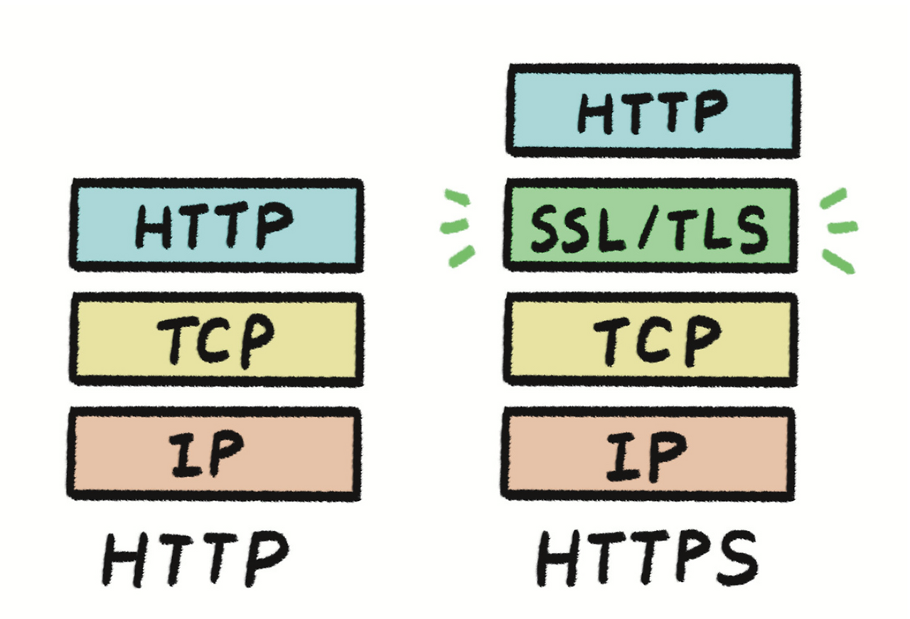

# 브라우저에 naver.com을 입력하면, 어떤 일이 일어날까요?

# 네트워크 내용을 정리해볼까?

브라우저 렌더링 과정을 제외하고 **'주소 입력부터 서버의 응답까지'**

통신 과정에 초점을 맞춘 발표 자료(Markdown 형식)를 구성했습니다.

프론트엔드는 어떤 부분에 집중해야 할 지 고민은 되지만,

일단 모두 알아두면 좋을 것 입니다.

 

---

# 1. 이름표를 주소로 (DNS Lookup)

## **주소창 입력**

- **1. URL 파싱 & 캐시 확인**:
    - 사용자가 `naver.com` 입력 → 브라우저가 URL 구조(프로토콜, 도메인) 분석.
    - **최초 확인**: **브라우저 캐시**에 이전에 방문했던 데이터가 유효한지 확인. (가장 빠른 응답!)

## **DNS Lookup**

- **문제**: 서버는 `naver.com`이 아닌 **IP 주소**만 이해합니다.
- **DNS (Domain Name System)**: 도메인 → IP 주소로 변환하는 시스템.
- **프로세스**:
    - 로컬 캐시 → ISP DNS 서버 → 계층적 서버 조회 → **IP 주소 획득**.
- **🔥 Optimization Point (최적화)**:
    - **DNS Prefetching**: HTML `<link rel="dns-prefetch" href="//naver.com">`
    - 미리 DNS 룩업을 수행하여 **초기 지연 시간(Latency)**을 줄입니다.

---

# 2. 안전한 통신로 확보 (Handshake)

## **TCP Handshake - 통신 연결**

- **목표**: IP 주소를 아는 서버와 데이터를 주고받을 수 있는 **신뢰성 있는 연결(Reliable Connection)**을 만듭니다.
- **TCP 3-way Handshake**:
    1. **SYN** (클라이언트): 나 연결 원해.
    2. **SYN-ACK** (서버): 알았어, 준비됐니?
    3. **ACK** (클라이언트): 응, 데이터 보낼 준비 완료.
- **지연**: 각 단계는 **왕복 시간(RTT)**을 소모합니다.

## **TLS Handshake - 보안 연결 (HTTPS)**

- **Naver는 HTTPS**: 보안을 위해 **암호화 통신**이 필수입니다.
- **TLS Handshake**:
    - TCP 연결 후, 암호화 알고리즘과 키를 교환하고 **서버 인증서**를 검증하는 과정.
- **지연**: 보안을 위해 TCP 외에 **추가적인 왕복 시간**이 발생하여 초기 로딩이 길어집니다.

### 과정

1. **ClientHello (연결 요청 및 능력 제시) [client → server]**
    - **"나 연결하고 싶어!"**
    - 지원하는 **TLS 버전** (예: 1.3)
    - 지원 가능한 **암호화 스위트** 목록 (Cipher Suites)
    - **Client Random** 값 (비밀 키 생성용) 전송
2. **ServerHello & Certificate (능력 선택 및 신원 증명) [server → client]**
    - **선택**: 클라이언트 목록 중 가장 적합한 **TLS 버전**과 **암호화 스위트**를 선택.
    - **신원 증명**: 서버의 **인증서(Certificate)**를 전송. (클라이언트가 서버의 공개 키와 신뢰성을 검증)
    - **Server Random** 값 전송.
3. **Key Exchange (비밀 키 공유) [client → server]**
    - **목표**: 이후 데이터 통신에 사용할 **대칭 세션 키**를 안전하게 만듭니다.
    - **키 교환 방식**: (주로 ECDHE 같은 알고리즘 사용)
        - 클라이언트와 서버가 **Client Random**, **Server Random**, 그리고 **Key Exchange**를 통해 공유된 비밀 정보를 조합하여 **Master Secret**을 생성.
        - **이 Master Secret으로 최종적인 '대칭 세션 키'가 만들어집니다.**
4. **Finished (암호화 통신 시작) [server→client]**
- **확인 및 시작**:
    - 클라이언트/서버 모두 **세션 키**를 사용하여 **Finished** 메시지를 암호화하여 상대방에게 전송.
    - 상대방이 이를 성공적으로 **복호화**하면 Handshake 성공!
    - **이후부터 모든 데이터 통신은 이 세션 키로 암호화되어 전송됩니다.**

---

- **🔥 Optimization Point (최적화)**:
    - **HTTP/2, HTTP/3**: TCP/TLS 연결이 수립된 후, 데이터를 더 효율적으로 주고받기 위한 **차세대 프로토콜**을 적용합니다. (특히 HTTP/3는 초기 연결 속도 개선에 탁월)

---

# 3. 데이터를 주고받다 (HTTP Request & Response)

### **요청(Request)과 응답(Response)**

- **클라이언트 Request**: 연결된 통신로를 통해 HTML을 요청합니다.
    - **핵심 요소**: 메소드(`GET`), 요청 URL, **헤더** (Cookie, Cache-Control 등)
- **서버 Response**: 요청받은 HTML 파일을 응답합니다.
    - **핵심 요소**: 상태 코드(`200 OK`), **헤더** (Content-Type, Content-Length, **Cache-Control**), **바디** (HTML 내용)

### **성능을 위한 캐싱 전략**

- **캐싱의 역할**: 서버 응답 헤더에 명시된 **`Cache-Control`** 정보를 보고, 브라우저가 이 리소스를 얼마나 오래 저장하고 재사용할지 결정합니다.
    - **`max-age`**: 다음에 같은 리소스를 요청할 때 서버에 물어보지 않아도 되는 시간.
- **🔥 Optimization Point (최적화)**:
    - **CDN (Contents Delivery Network)**: 사용자와 물리적으로 가까운 서버(Edge Server)를 통해 응답하여 **지연 시간을 획기적으로 단축**합니다.
    - **압축**: Gzip, Brotli 압축을 통해 응답 바디의 크기를 줄입니다.

---

### 5. 요약 및 Next Step

- **Key Takeaways**:
    1. **DNS**는 주소를 찾고 (**Prefetching**).
    2. **TCP/TLS**는 연결하고 (**HTTP/2, /3**).
    3. **HTTP**는 데이터를 주고받습니다 (**CDN, Cache**).

프론트엔드 개발자는 이 **네트워크 병목 구간**을 잘 이해하고 최적화해야 합니다.

### 참고자료

https://se-juno.tistory.com/7